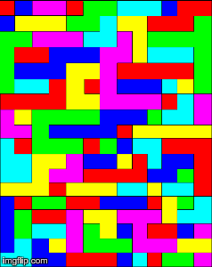

# floodi-ia
Trabalho de Inteligencia Artificial - Busca com heurística

### FloodIt




### Funcionamento do algoritmo
Primeiro a entrada é lida como uma matriz de inteiros e depois transformada em um grafo (sendo um nodo para cada celula). Após a transformação, os vizinhos de todos os nodos são setados e os nodos consecutivos com mesma cor em um único nodo são unidos. Depois disso, acha-se o nodo mais distante do nodo inicial.

Para decidir a cor de cada iteração, o algoritmo escolhe a cor do vizinho que tem a maior das distancias entre todos os vizinhos, repetindo até que o grafo seja um único nodo.

Para a posição inicial, o nodo que tem a maior regiao (maior número de vizinhos) é escolhido.


### Especificação do trabalho
O seu programa deve receber uma  instância do jogo a partir da entrada
padrão do sistema.

Uma instância é dada por um arquivo texto no seguinte formato:

  - a  primeira linha  do arquivo  tem 3  números inteiros  n, m  e k,
    separados por espaço, onde n é  o número de linhas do tabuleiro, m
    é  o número  de colunas  do  tabuleiro e  k  é o  número de  cores
    presentes no tabuleiro;

  - o restante do arquivo contém n linhas com m números inteiros cada,
    separados por espaços,  sendo que cada um  destes valores pertence
    ao intervalo [1..k];

  - o exemplo abaixo é uma instância do jogo com 4 linhas, 5 colunas e
    3 cores:
  
  ```
    4 5 3
    2 3 2 3 2 
    2 1 2 3 3 
    3 1 2 3 2 
    1 2 2 1 3 
  ```

A saída do seu  programa deve ser pela saída padrão  do sistema e deve
conter duas linhas  de texto:

  - a primeira linha deve conter três valores separados por espaços:
  
    - dois números inteiros indicando a linha e a coluna da posição de
      referência para as operações de pintura, as linhas são numeradas
      no intervalo [1..n] e as colunas no intervalo [1..m];

    - um número inteiro  que indica o tamanho da  sequencia de números
      da segunda linha;

  - a  segunda linha  deve conter  uma sequência  de números  inteiros
    pertencentes ao intervalo [1..k], separados por espaço e terminada
    por uma quebra de linha.

Esta sequência representa as cores que  devem ser usadas para pintar o
tabuleiro com  uma única  cor.  A  operação de pintura  muda a  cor da
região  que contém  a célula  do tabulerio  indicada pelos  valores de
linha e coluna na primeira linha da saída do programa.

Uma  região é  dada por  um conjunto  de células  adjacentes de  mesma
cor. Uma célula  faz parte de uma  região se é adjacente  a pelo menos
uma outra  célula da região. Toda  célula na posição <x,y>  tem outras
quatro células adjacentes:
```
  - vizinho da esquerda: se y == 1, <x,m>, senão <x,y-1>;
  - vizinho da direita:  se y == m, <x,1>, senão <x,y+1>;
  - vizinho de cima:     se x == 1, <n,y>, senão <x-1,y>;
  - vizinho de baixo:    se x == n, <1,y>, senão <x+1,y>.
```

Note  que nesta  versão  do jogo  a  primeira e  a  última linhas  são
adjacentes assim como a primeira e  a última colunas. O tabuleiro é um
toróide.

Por exemplo,  considere a seguinte  saída, para o tabuleiro  dado como
exemplo:
```
  2 4 3
  2 1 3
```

Os valores 2 e 4 na primeira linha indicam que as operações de pintura
terão como  referência a céluna  da segunda  linha e quarta  coluna. O
valor 3 da primeira linha indica que a sequência tem 3 operações.

Ao aplicar as operações de pintura,  usando esta sequência de cores da
segunda linha, as seguintes transformações ocorrem no tabuleiro:

Pintar com a cor 2:
```
  2 3 2 2 2 
  2 1 2 2 2 
  3 1 2 2 2 
  1 2 2 1 3 
```
Pintar com a cor 1:
```
  1 3 1 1 1 
  1 1 1 1 1 
  3 1 1 1 1 
  1 1 1 1 3 
```
Pintar com a cor 3:
```
  3 3 3 3 3 
  3 3 3 3 3 
  3 3 3 3 3 
  3 3 3 3 3 
```
Note  que ao  final  o tabuleiro  tem uma  única  cor. Portanto,  esta
sequência resolve a instância dada como exemplo.
